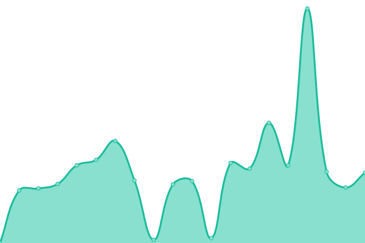

# [📈 Live Status](https://Ek2100.github.io/upptime): <!--live status--> **🟩 All systems operational**

This repository contains the open-source uptime monitor and status page for [Ek2100](https://Ek2100.github.io/upptime), powered by [Upptime](https://github.com/upptime/upptime).

<!--start: status pages-->
<!-- This summary is generated by Upptime (https://github.com/upptime/upptime) -->
<!-- Do not edit this manually, your changes will be overwritten -->
<!-- prettier-ignore -->
| URL | Status | History | Response Time | Uptime |
| --- | ------ | ------- | ------------- | ------ |
|  [Rock Paper Scissors API](https://rps-api.eliaskhoury1.repl.co/) | 🟩 Up | [rock-paper-scissors-api.yml](https://github.com/Ek2100/upptime/commits/HEAD/history/rock-paper-scissors-api.yml) | 

 2617ms
     
 | 

<a href="https://Ek2100.github.io/upptime/history/rock-paper-scissors-api">98.39%</a>
    

|  [Disboard Pinger](https://disboard-auto-bump-selfbot.eliaskhoury1.repl.co) | 🟩 Up | [disboard-pinger.yml](https://github.com/Ek2100/upptime/commits/HEAD/history/disboard-pinger.yml) | 

 8297ms
     
 | 

<a href="https://Ek2100.github.io/upptime/history/disboard-pinger">98.32%</a>
    

<!--end: status pages-->

[**Visit our status website →**](https://Ek2100.github.io/upptime)
